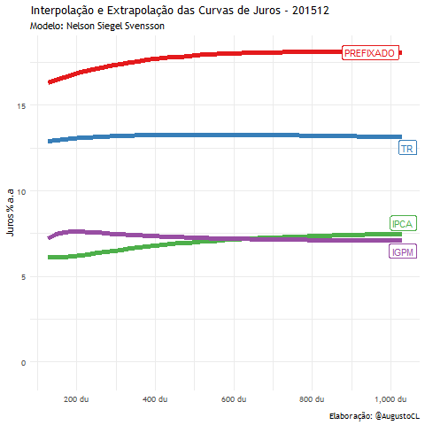

## Histórico das Curvas de Juros Futuras dos Cupons: PRÉ, IPCA, IGPM e TR

### Visão Geral
Esse projeto utiliza o modelo extrapolação e interpolação de curvas *NelsonSiegelSvensson* para a obtenção do histórico das curvas de juros futuras **pré**, **ipca**, **igpm** e **tr**, gerando como output:

1. Um arquivo .xlsx com 4 abas, cada uma com o histórico de dez/2015 a fev/2020 das respectivas taxas

2. Um arquivo .gif, que apresenta a visualização histórica das 4 curvas para cada momento no tempo.

### Ferramentas Utilizadas
Para o projeto, foram utilizados dois scripts para as seguintes tarefas: 

1. Python (curvas_historicas.py)
   - Extração dos parâmetros mensais no site da SUSEP de forma estruturada (Webscrapping)
   - Geração das curvas futuras para cada período, aplicando os parâmetros no modelo NelsonSiegelSvensson
2. R (visualiz_curvas.R)
   - Tratamento e limpeza dos dados  
   - Execução da visualização .gif do comportamento histórico das curvas de juros futuros

### Breve Descrição das Atividades
O script .py extrai todos os parâmetros mensais disponibilizados no site da [SUSEP](http://www.susep.gov.br/setores-susep/cgsoa/coris/dicem/modelo-de-interpolacao-e-extrapolacao-da-ettj), efetua o tratamento dos dados para a saída de uma tabela estruturada, e utiliza os parâmetros para a geração de todas as curvas futuras, gerando o output final em .xlsx

O script .R trata o output das curvas em .xlsx e gera a animação .gif com o histórico das 4 curvas em cada momento no tempo.

